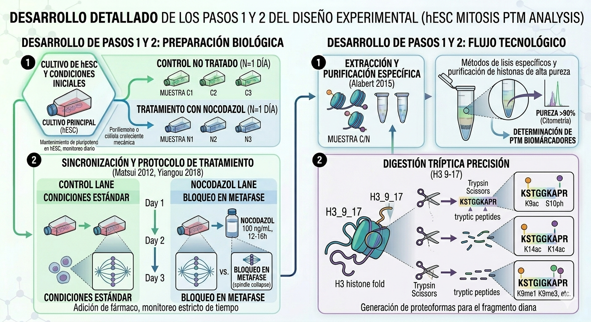
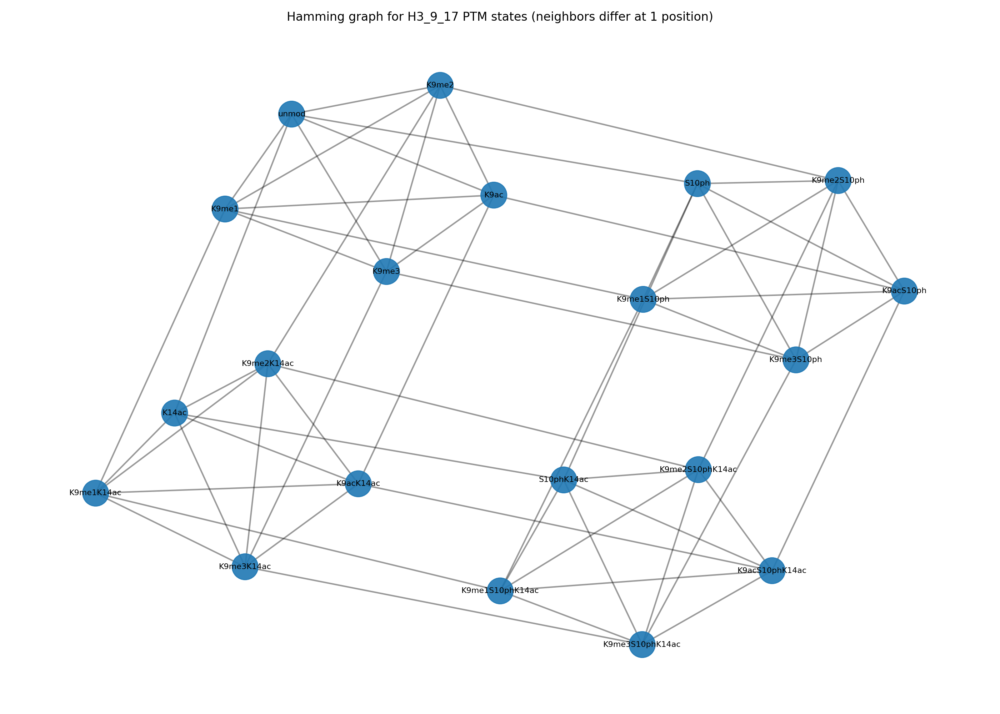

```{r}
#| label: setup-paths
#| include: false

root_dir  <- "C:/Users/marti/Dropbox/TFM_PTM_Histonas/RProyecto_composicional"
img_dir   <- file.path(root_dir, "Imagenes")
datos_dir <- file.path(root_dir, "DatosProcesados")
```

## Fragmento H3 (aa 9-17)

Tal como se ha comentado en la @sec-fragmento-h3917, el conjunto de
datos de este trabajo se ha centrado en el fragmento de la Histona H3
que comprende los residuos 9 al 17 (secuencia KSTGGKAPR). Este segmento
se caracteriza por la presencia de múltiples sitios de modificación
postraduccional que actúan como nodos críticos de señalización
[@jenuwein2001], como la lisina 9 (K9), la serina 10 (S10) y la lisina
14 (K14). Su proximidad física permite mecanismos complejos de
“crosstalk”, como el “interruptor fosfo-metil” (en el que la
fosforilación de S10 induce la disociación de HP1 de la K9 metilada)
[@fischle2003; @hirota2005] y el emparejamiento sinérgico entre la
fosforilación de S10 y la acetilación de K14 [@lo2000; @cheung2000].
Para capturar las proteoformas combinadas que definen estos estados
celulares se requiere el análisis integrado de este fragmento
[@seligson2005; @park2022].

## Datos y diseño del estudio

### Base de datos

A partir de los resultados obtenidos mediante espectrometría de masas,
se construyó un conjunto de datos estructurado (específicamente un
*data.frame*) que integra la información de las seis muestras
analizadas. Este archivo contiene la cuantificación de las abundancias
relativas de las distintas proteoformas (combinaciones de modificaciones
en un mismo péptido) identificadas en el fragmento **H3
9-17**($K _9 - S_{10} - K_{14}$).

Los campos del conjunto de datos se dividen en variables de diseño
experimental y variables de composición biológica, las cuales se
describen en detalle a continuación:

#### Variables de Diseño

- **`Estado` (Factor)**: Indica la condición de la muestra.

  - `asinc`: Células en estado asincrónico (Grupo Control, sin
    tratamiento).

  - `mitot`: Células enriquecidas en mitosis (Grupo Tratado con
    Nocodazol).

- **`Dia` (num)**: Indica el bloque temporal o réplica (Día 1, 2 o 3).
  Sirve para controlar la variabilidad inter-día en el modelo
  estadístico.

#### Variables de composición biológica (Proteoformas)

Los valores numéricos representan la **abundancia relativa** (proporción
respecto al total del fragmento). El campo **`unmod`** representa la
fracción del péptido que no tiene ninguna modificación.

El resto de los campos detallan las modificaciones en los tres sitios
clave del fragmento (**K9, S10, K14**):

##### Modificaciones Simples

- **`K9me1`, `K9me2`, `K9me3`**: Monometilación, dimetilación o
  trimetilación en la Lisina 9.

- **`K9ac`**: Acetilación en la Lisina 9.

- **`S10ph`**: Fosforilación en la Serina 10 (se espera que este valor
  sea mucho mayor en el estado `mitot`).

- **`K14ac`**: Acetilación en la Lisina 14.

##### Modificaciones Dobles (Crosstalk)

Representan péptidos donde dos residuos están modificados
simultáneamente:

- **Metilación + Acetilación**: `K9me1K14ac`, `K9me2K14ac`,
  `K9me3K14ac`.

- **Acetilación Doble**: `K9acK14ac` (K9 y K14 acetiladas).

- **Fosfo-Metil (Interruptor Mitótico)**: `K9me1S10ph`, `K9me2S10ph`,
  `K9me3S10ph`. Estas son cruciales para observar la expulsión de
  proteínas HP1 durante la mitosis.

- **Fosfo-Acetil**: `K9acS10ph` y `S10phK14ac` (Sinergia de activación).

##### Modificaciones Triples (Proteoformas Complejas)

Representan el estado más complejo del péptido, con modificaciones en
los tres sitios a la vez:

- **`K9me1S10phK14ac`**, **`K9me2S10phK14ac`**, **`K9me3S10phK14ac`**:
  Combinan metilación (K9), fosforilación (S10) y acetilación (K14).

- **`K9acS10phK14ac`**: La forma totalmente acetilada y fosforilada.

### Diseño experimental

```{r}
#| label: fig-desing
#| fig-cap: "Representacion esquemática del diseño de experimentos"
#| echo: false
#| out-width: "100%"
#| fig-align: "center"


```

Para este estudio estadístico, se empleó un diseño de experimentos
basado en réplicas independientes recolectadas en tres días distintos,
esquematizado en la @fig-desing .

Se utilizaron células madre embrionarias humanas (hESC), de una misma
linea, mantenidas en condiciones de pluripotencia. Cada día de
experimentación, se establecieron dos cultivos independientes: uno
destinado al grupo ***'asinc'*** (muestras 1, 3, 5) , mantenido bajo
condiciones fisiológicas estándar, y otro destinado al grupo
***'mitot'*** (muestras 2, 4, 6). En este último, se indujo un bloqueo
en la fase de metafase mediante la adición de 100 ng/mL de nocodazol
durante un periodo de 12 a 16 horas [@matsui2012; @yiangou2019]. Tras el
tratamiento, las células enriquecidas en mitosis se recolectaron
mediante la técnica de específica seguida de una lisis celular inmediata
para la extracción de histonas [@alabert2015; @sidoli2016]. Este diseño
generó un total de 6 muestras biológicas independientes, cuya
distribución de abundancias relativas de PTMs en el fragmento H3 9-17
fue analizada mediante métodos estadísticos para datos composicionales.

### Predictores

Las covariables se organizan en una matriz de diseño de dimensión
$(N \times P)$ $(N = 6$
$\text{ muestras, P efectos incluidos en el modelo)}$. En todos los
modelos se podrán considerar:

- `Estado`: factor con dos niveles (`asinc`, `mitot`), que representa el
  contraste biológico principal.
- `Dia`: variable numérica (1, 2, 3), que permite capturar posibles
  tendencias asociadas al día (efectos de lote, deriva técnica).

En la práctica se usa una matriz de diseño del tipo:

$$X_i =
(1, \text{Estado}_i, \text{Dia}_i)$$

donde el primer término es el intercepto, el segundo codifica el efecto
de pasar de asíncrono a mitótico y el tercero, cuando se incluye, recoge
un posible efecto aleatorio del día. Este esquema se mantiene en los
distintos modelos para facilitar la comparación entre enfoques
(limma/edgeR, Dirichlet, modelos log‑normales).

No obstante, antes de proceder a la formulación matemática de cada
modelo, es fundamental examinar de qué manera la naturaleza
composicional de los datos limita y determina el espacio de soporte de
estas variables.

### Naturaleza de los Datos: Datos Composicionales (Simplex)

La característica más crítica los datos, y la que dictará el modelo
matemático, es que los valores de las proteoformas se expresan como
**proporciones relativas**. En cada muestra, la suma de las abundancias
de todas las proteoformas detectadas para el péptido 9-17 es igual a 1
(o 100%), se caracterizon por:

1.  **Restricción de Suma Constante:** Las variables no son
    independientes. Si la proporción de la proteoforma "H3K9me3"
    aumenta, al menos una de las otras debe disminuir obligatoriamente
    para que la suma siga siendo 100%. Esto genera correlaciones
    negativas artificiales.

2.  **Rango Acotado:** Los datos están restringidos al intervalo \[0,
    1\]. Un modelo de regresión lineal simple podría predecir valores
    negativos o superiores al 100%, lo cual es biológicamente imposible.

3.  **Heterocedasticidad:** La varianza de las proporciones suele ser
    mayor cerca del 0.5 y menor cerca de los extremos (0 o 1), lo que
    viola el supuesto de homogeneidad de varianza necesario para un
    ANOVA convencional.

#### Características de los datos

De acuerdo con las revisiones de **Carlberg** [@carlberg2023] y
**Völker-Albert** [@völker-albert2018], identificamos tres propiedades
que obligan a usar modelos de **Regresión de Dirichlet** o
**Transformaciones Log-ratio**:

1.  **Sesgo de detectabilidad**: Durante la mitosis, la cromatina se
    compacta masivamente. Los datos muestran que ciertas marcas, como la
    fosforilación en H3S10 o la desacetilación global, cambian
    drásticamente. Esto introduce un ruido técnico diferencial: la
    facilidad para ionizar y detectar el péptido 9-17 puede variar entre
    una célula asíncrona y una mitótica. Este hecho puede inducir un
    posible **sesgo de detectabilidad** que se corrige con el uso de
    patrones internos o péptidos sintéticos que tengan un comportamiento
    similar en la ionización que el péptido problema.

2.  **Diversidad de las modificaciones en el Fragmento 9-17**: En este
    tramo de 9 aminoácidos, podemos encontrar:

- K9: puede estar no modificada, me1, me2, me3 o ac.
- S10: puede estar fosforilada o no (clave en mitosis).
- K14: puede estar acetilada o no.

Esto genera una matriz de datos con muchas columnas (proteoformas) donde
existen celdas con **ceros**, que corresponden a proteoformas "raras".
Desde el punto de vista del análisis químico los "ceros" corresponden a
valores por debajo del límite de detección. El modelo debe ser "robusto
ante la dispersión" (*sparsity-robust*).

3.  **Interdependencia Biológica (Crosstalk)**: Para la estructura de la
    base de datos se ha tenido en cuenta lo postulado en la hipótesis
    del código de histonas, de forma que la estructura represente la
    interdependencia entre modificaciones (PTMs) dentro del fragmento
    9-17. En lugar de comparar abundancias aisladas, la base de datos
    recoge vectores de proporciones de cada proteoforma, permitiendo
    considerar simultáneamente marcas como la fosforilación en S10 y las
    modificaciones en K9, cuya aparición conjunta está regulada
    biológicamente.

### Posibles sesgos y limitaciones del diseño

El presente diseño experimental y la naturaleza de los datos de
abundancia relativa de proteoformas en el fragmento H3 (aa 9–17) están
sujetos a diversas fuentes de sesgo que es necesario explicitar y tener
en cuenta a la hora de interpretar los resultados.

#### Sesgos metodológicos

- **Sesgo de detección por espectrometría de masas**: Durante la
  mitosis, la compactación masiva de la cromatina altera las propiedades
  fisicoquímicas de las histonas, modificando la eficiencia de
  ionización del péptido 9–17 en comparación con las células asíncronas.
  En consecuencia, las diferencias observadas en la abundancia relativa
  de determinadas proteoformas pueden reflejar no solo cambios
  biológicos reales, sino también artefactos técnicos ligados a una
  detectabilidad diferencial entre condiciones.

- **Sesgo de enriquecimiento por “mitotic shake-off”**: La recolección
  de células mitóticas se basa en la técnica de “mitotic shake-off”, que
  selecciona preferentemente aquellas células que se desprenden con
  mayor facilidad del sustrato. Este procedimiento tiende a enriquecer
  subpoblaciones en prometafase/metafase y puede infra-representar fases
  más tempranas o tardías de la mitosis, sesgando así el perfil de PTMs
  hacia estados mitóticos concretos.

- **Sesgo de censura y dispersión (“sparsity”)** La matriz de datos
  contiene numerosas celdas con valor cero correspondientes a
  proteoformas raras o de baja abundancia, especialmente entre las
  combinaciones dobles y triples de modificaciones. Desde el punto de
  vista analítico, muchos de estos ceros representan valores por debajo
  del límite de detección del espectrómetro, no una ausencia biológica
  real, lo que introduce un sesgo de censura. Para poder aplicar modelos
  de regresión composicional es necesario recurrir a estrategias de
  imputación de ceros, lo que añade una capa adicional de incertidumbre
  y puede influir en la estimación de efectos sutiles sobre proteoformas
  poco abundantes.

#### Sesgos de diseño experimental

- **Tamaño muestral reducido**: El diseño incluye únicamente tres
  réplicas biológicas por condición (n = 3 para asíncronas y n = 3 para
  mitóticas), generando un total de seis muestras independientes. Este
  tamaño muestral limitado reduce el poder estadístico para detectar
  cambios modestos en las abundancias relativas e incrementa la
  sensibilidad del análisis a la presencia de valores atípicos o
  variaciones inter-día no modeladas.

- **Sesgo de “batch” asociado al efecto día**: Las muestras se obtienen
  en tres días experimentales diferentes, que actúan como bloques
  temporales en el diseño. Aunque la inclusión de la variable “Día” en
  el modelo ayuda a capturar parte de la variabilidad técnica inter-día,
  el número reducido de bloques (tres) puede resultar insuficiente para
  describir plenamente fluctuaciones sistemáticas debidas a cambios en
  las condiciones experimentales, el rendimiento del equipo o la
  preparación de reactivos.

- **Ausencia (o posible insuficiencia) de controles internos
  estandarizados**: Se ha discutido la existencia de un posible sesgo de
  detectabilidad y menciona que este puede corregirse mediante el uso de
  patrones internos o péptidos sintéticos con comportamiento de
  ionización similar al péptido problema, pero no especifica de forma
  inequívoca si tales controles se incorporaron efectivamente a este
  conjunto de datos. La ausencia o empleo limitado de estos estándares
  internos restringe la capacidad de normalizar las diferencias técnicas
  entre series analíticas y dificulta separar con claridad los efectos
  puramente biológicos de las variaciones instrumentales.

## Preprocesado y transformaciones composicionales

Como las 20 proteoformas son proporciones que suman uno, se cierran
explícitamente a suma uno cuando es necesario y se trabajan en el
simplex $S^{19}$. Para utilizar modelos lineales y gaussianos, se
recurre a transformaciones log‑ratio [@egozcue2003; @greenacre2021]:

- **Transformación CLR** (centered log‑ratio): se utiliza como entrada
  de los modelos lineales moderados (limma).Para la muestra (i),
  $$\operatorname{clr}(y_{ik})  =  \log (\frac{y_{ik}}{g(y_i)}), \quad 
  g(y_i) = \left(\prod_{k=1}^{20} y_{ik}\right)^{1/20}$$

Esta transformación lleva las composiciones a un espacio euclídeo de
suma cero y permite ajustar modelos lineales con errores aproximadamente
normales [@smyth2004; @smyth2005]

- **Transformación ILR** (isometric log‑ratio): se emplea en los modelos
  log‑normales y de campo epistático. Dada una base ortonormal $V$ del
  subespacio de suma cero, se define $z_i = V^\top \log(y_i)$. De este
  modo, las coordenadas ILR pueden modelarse con distribuciones normales
  multivariantes estándar y la matriz de covarianza (o de precisión) no
  es singular [@egozcue2003; @vandenboogaart2013]

Las transformaciones se aplican solo a las columnas composicionales (las
20 proteoformas). Las covariables (`Estado`, `Dia`) se mantienen en su
escala original y se usan para construir la matriz de diseño.

## Modelos estadísticos

### Modelos lineales moderados: limma, voom-limma y edgeR {#sec-modelos-lineales-moderados-limma-voom-limma-y-edger}

El análisis de las proteoformas individuales se basa en modelos lineales
moderados, que se pueden describir de forma unificada en tres niveles
(media, varianza ponderada y prior empírico‑bayesiano), como se detalla
a continuación

#### Marco Genérico Unificado

Sea $y_{gi}$ la medida observada (conteos, abundancias o intensidades)
para el gen o característica $g$ ($g = 1, \dots, G$) en la muestra $i$
($i = 1, \dots, n$).

##### Nivel I: Componente Sistemático (Modelo Lineal)

Para cada gen $g$, la esperanza matemática o el predictor lineal se
define mediante una matriz de diseño común $X_{n \times p}$:

$$E(y_{gi}) = \mu_{gi} \quad \text{con} \quad g(\mu_{gi}) = \eta_{gi} = x_i^T \beta_g$$

Donde:

- $x_i^T$ es la fila $i$-ésima de la matriz de diseño $X$.
- $\beta_g = (\beta_{g1}, \dots, \beta_{gp})^T$ es el vector de
  coeficientes de efectos biológicos para el gen $g$.
- $g(\cdot)$ es la función de enlace (link function).

##### Nivel II: Estructura de la Varianza Ponderada

La variabilidad de la variable respuesta se modela introduciendo pesos
heterocedásticos estructurales ($w_{gi}$) condicionados a un parámetro
de escala global específico del gen ($\theta_g$):

$$\text{Var}(y_{gi}) = w_{gi} \cdot \theta_g$$

##### Nivel III: Prior Jerárquico (Bayes Empírico)

Para resolver la inestabilidad de las varianzas debida a tamaños
muestrales pequeños ($n$ pequeño), se asume que los parámetros de escala
$\theta_g$ provienen de una distribución previa inversa chi-cuadrada
conjugada común a lo largo de todo el genoma:

$$\theta_g \sim \text{Inv-}\chi^2(d_0, \theta_0)$$

Donde $d_0$ representa los grados de libertad a priori y $\theta_0$ es
el valor central de la escala global.

Mediante este prior, el estimador muestral puntual del gen ($t_g$)
calculado de forma independiente con $d_g$ grados de libertad residuales
se contrae de forma continua hacia el centro de la distribución,
definiendo el **parámetro moderado** ($\tilde{\theta}_g$):

$$\tilde{\theta}_g = \frac{d_0 \theta_0 + d_g t_g}{d_0 + d_g}$$

#### Contraste de Hipótesis y Estadísticos Moderados

Para evaluar un contraste biológico definido por la hipótesis nula
$H_0: c^T\beta_g = 0$ (donde $c$ es un vector o matriz de contrastes),
se define el estimador del contraste como
$\hat{\beta}_{g,c} = c^T\hat{\beta}_g$.

El error estándar no moderado del contraste se denota como:

$$s_{\hat{\beta}_{g,c}} = \sqrt{t_g \cdot v_{gc}}$$

Donde $v_{gc} = c^T (X^T W_g X)^{-1} c$ es el factor de escala no
escalado derivado de la matriz de diseño $X$ y de la matriz de pesos
observacionales diagonal $W_g = \text{diag}(w_{g1}, \dots, w_{gn})$.

Al sustituir el estimador puntual $t_g$ por el parámetro moderado
Bayesiano ($\tilde{\theta}_g$), se formulan los estadísticos de
contraste específicos de cada metodología. La ventaja matemática
fundamental es que **los grados de libertad del denominador aumentan
de** $d_g$ a $d_0 + d_g$, lo que dota a los tests de una gran robustez
frente a falsos positivos y una potencia estadística óptima.

#### Tabla Comparativa

A continuación se detalla la parametrización exacta que adopta cada
herramienta dentro del marco general unificado:

| Componente / Parámetro | `limma` | `edgeR` (QL Framework) | `voom-limma` |
|:---|:---|:---|:---|
| **Variable observada (**$y_{gi}$) | Intensidad continua ($\log_2$) | Conteo digital crudo ($Y_{gi}$) | $\log_2(\text{CPM})$ transformada |
| **Distribución (*Likelihood*)** | Gaussiana: $\mathcal{N}(\mu_{gi}, \sigma_g^2)$ | Binomial Negativa: $\mathcal{NB}(\mu_{gi}, \phi_g)$ | Gaussiana: $\mathcal{N}(\mu_{gi}, w_{gi}\sigma_g^2)$ |
| **Función de enlace** $g(\mu_{gi})$ | Identidad | Logarítmica (con *offset* $\log N_i$) | Identidad |
| **Peso estructural (**$w_{gi}$) | Ponderación idéntica ($w_{gi} = 1$) | Varianza NB: $\mu_{gi} + \phi_g \mu_{gi}^2$ | Función Lowess: $\hat{f}(\hat{\mu}_{gi})^{-4}$ |
| **Hiperparámetro moderado (**$\theta_g$) | Varianza residual $\sigma_g^2$ | Dispersión Cuasi-Verosímil $\frac{\text{Var}(y_{gi})}{\mu_{gi} + \phi_g \mu_{gi}^2} = \zeta_g$ | Varianza residual ponderada $\sigma_g^2$ |
| **Ecuación del Prior (EB)** | $\sigma_g^2 \sim \text{Inv-}\chi^2(d_0, \sigma_0^2)$ | $\zeta_g \sim \text{Inv-}\chi^2(d_0, \zeta_0)$ | $\sigma_g^2 \sim \text{Inv-}\chi^2(d_0, \sigma_0^2)$ |
| **Estadístico de Contraste** | $\tilde{t}_g = \frac{\hat{\beta}_{g,c}}{\tilde{\sigma}_g \sqrt{v_{gc}}}$ | $\tilde{F}_g = \frac{\text{Dev}_{\text{Null}} - \text{Dev}_{\text{Full}}}{m \cdot \tilde{\zeta}_g}$ | $\tilde{t}_{g, \text{voom}} = \frac{\hat{\beta}_{g,c}^{\text{WLS}}}{\tilde{\sigma}_{g} \sqrt{v_{gc, \text{voom}}}}$ |
| **Distribución bajo** $H_0$ | $t$ de Student con $d_0 + d_g$ g.l. | $F$ de Snedecor con $m, d_0 + d_g$ g.l. | $t$ de Student con $d_0 + d_g$ g.l. |

### Aplicación de lineales moderados al analisis del fragmento H3 (aa 9-17)

A continuación se presenta como se aplican los distintos modelos
lineales moderados al estudio del comportamiento de las abundancias
relativas las proteoformas del fragmento 9-17 de la histona H3 cuando
las células de detienen en la primera etapa de la mitosis por
tratamiento con nocodazol.

Para los modelos dependientes de conteos se transforman los datos de
abundancias relativas en pseudoconteos multiplicando las proporciones
por $10^6$

#### **limma sobre datos CLR.**

En los datos CLR, para cada proteoforma (g) se ajusta un modelo lineal:
$$\mathbf{y}_g = X \beta_g + \varepsilon_g,\quad \varepsilon_g \sim
N(0, \sigma_g^2 I_N)$$

- donde (X) es la matriz de diseño
- $\beta_g$son los coeficientes (incluyendo el efecto del estado)
- $\sigma_g^2$ la varianza residual.

`limma` implementa este marco asumiendo distribuciones gaussianas y
varianzas moderadas de acuerdo con lo descrito en
@sec-modelos-lineales-moderados-limma-voom-limma-y-edger

Se usa la versión dependiente de la intensidad (IBMT: `trend = TRUE`,
`robust = TRUE`), que permite que la varianza prior dependa suavemente
de la intensidad media y reduce falsos positivos en proteoformas de baja
abundancia [@sartor2006]. A partir del ajuste se obtienen, para cada
proteoforma, estimaciones de cambio (log‑fold change en escala CLR), un
estadístico t moderado y valores de FDR.

#### **voom-limma para datos de conteo.**

Para las PTM transfromadas en pseudoconteos, el método `voom` transforma
los conteos normalizados (p. ej. con Trimed means M-values, TMM) en
logarinto de cuentas por millon (log‑CPM) y estima una relación
media–varianza, asignando un peso de precisión a cada observación. Los
datos transformados y ponderados se analizan con el mismo modelo lineal
moderado de limma, lo que permite aplicar la misma maquinaria de
contrastes y moderación a datos de conteo [@law2014].

#### **edgeR para modelos de conteo.**

De forma complementaria se usa `edgeR`, que modela directamente los
conteos mediante una distribución binomial negativa (NB), donde la
varianza incluye un término de dispersión biológica [@robinson2010].
Para cada proteoforma (g) y muestra (i),
$y_{ig} \sim \mathrm{NB}(\mu_{ig}$, $\phi_g)$, $\quad \log(\mu_{ig}) =$
$\log(\mathrm{offset}_i) + X_i \beta\_g$, donde $\phi_g$ es la
dispersión y el offset recoge los factores de normalización (TMM). La
dispersión se estima en varios niveles (común, con tendencia, y
“tagwise”) y se modera mediante un enfoque empírico‑bayesiano
[@robinson2010] La inferencia se basa en tests de quasi‑verosimilitud
(QLF) o de razón de verosimilitud (LRT), recomendándose QLF con pocas
réplicas.

## Modelo regresión de Dirichlet clásica

La regresión de Dirichlet permite trabajar directamente con
composiciones, modelando simultáneamente todo el vector de proporciones
sin necesidad de transformaciones previas [@hijazi2009; @maier2014;
@sennhenn-reulen2018].

Sea $Y_i = (Y_{i1}, \dots, Y_{iK})$ la composición observada en la
muestra $n$ y $x_n$ la fila correspondiente de la matriz de diseño $X$;
se asume

$$Y_n \mid \boldsymbol{\alpha}_i \sim \mathrm{Dirichlet}(\boldsymbol{\alpha}_i),
\qquad
\boldsymbol{\alpha}_n = \phi_n \boldsymbol{\mu}_i,
\qquad
\boldsymbol{\mu}_i = \mathrm{softmax}(\boldsymbol{\eta}_i).$$

El predictor lineal por componente se define como
$$\eta_{i1} = 0, \qquad
\eta_{ik} = x_i^\top \boldsymbol{\beta}_k
            + \text{(efecto aleatorio de día si aplica)}, \quad k = 2,\dots,K,$$
de modo que la primera proteoforma actúa como categoría de referencia
($\boldsymbol{\beta}_1 = 0$) y los coeficientes $\boldsymbol{\beta}_k$
se interpretan como efectos de la condición experimental (y otras
covariables) sobre los log-odds de cada proteoforma frente a la de
referencia, mientras que la precisión $\phi_i$ controla la dispersión
global alrededor de la media composicional $\boldsymbol{\mu}_i$.

Sobre esta estructura se consideran cuatro variantes para $\phi_n$:
precisión común para todas las muestras, precisión por condición
experimental, y en ambos casos con o sin efecto aleatorio de día en el
predictor lineal, lo que permite capturar explícitamente la variabilidad
entre días de experimento.

## Modelo de campo epistático

El “modelo de campo epistático” combina una verosimilitud Dirichlet para
datos composicionales con una prior Gaussiana (impropia) sobre un campo
de potenciales que penaliza la epistasia, siguiendo la construcción de
Zhou y McCadlish [@zhou2020] y Chen et al.[@chen2021] adaptada al
fragmento H3 9‑17.

La media teórica de las proporciones de cada una de las $K$ PTM, se describe
mediante un vector de probabilidades $\boldsymbol{\pi}$, pero el modelo
no trabaja directamente sobre $\pi$, sino sobre un campo de potenciales
$\phi$ definido en el espacio de estados. La relación entre ambos
objetos se establece mediante una transformación softmax:

$$\pi_k = \frac{e^{-\phi_k}}{\sum_{j=1}^{K} e^{-\phi_j}}.$$

Así, los estados con menor potencial tienen mayor probabilidad esperada,
y el vector $\pi$ queda automáticamente dentro del simplex, que es el
espacio geométrico natural de los datos composicionales.

La verosimilitud de los datos se modela con una distribución de
Dirichlet, adecuada cuando cada réplica experimental es un vector de
proporciones. Si $Y_n$ es la composición observada en la réplica $n$,
entonces se asume

$$ Y_i \sim \text{Dirichlet}(\alpha_i)$$,

con $\alpha_i = \kappa_c \cdot \pi_c + e$, donde $c$ indica la
condición experimental de la muestra, $\kappa_c$ es un parámetro de
concentración y $e$ es una constante pequeña para evitar
problemas numéricos cuando alguna probabilidad es muy baja. El parámetro
$\kappa_c$ controla la dispersión entre réplicas: cuanto mayor es, más
cerca quedan las observaciones de la media teórica; cuanto menor es, más
variabilidad se permite alrededor de ella.

```{r}
#| label: fig-hamming
#| fig-cap: "Reperesentacion esquemática grafo de Hamming para el fragmento H3_9_17"
#| echo: false
#| out-width: "100%"
#| fig-align: "center"


```

La parte central del modelo está en cómo se define la distribución "a
priori" del campo $\phi$. En lugar de asumir que cada proteoforma es
independiente de las demás, se usa la estructura del grafo de Hamming
formado por todas las combinaciones posibles de marcas. En este grafo,
cada nodo representa una proteoforma y dos nodos están conectados si
difieren en una sola modificación elemental. Para el fragmento H3 9-17
estudiado en el informe, este espacio tiene 20 nodos, correspondientes
al producto de 5 estados en K9, 2 estados en S10 y 2 estados en K14
(@fig-hamming).

Sobre este grafo se cuantifica la epistasia mediante contrastes locales
entre conjuntos de cuatro nodos que forman cuadrados elementales. En el
caso más simple, el coeficiente de epistasia puede escribirse como

$$\epsilon = (\phi_{11} - \phi_{10}) - (\phi_{01} - \phi_{00}),$$que
mide cuánto cambia el efecto de una modificación dependiendo del estado
de otra. Cuando $\epsilon = 0$, el comportamiento es aditivo; cuando
$\epsilon \neq 0$, aparece interacción epistática [@zhou2020]. En el
caso general, todos esos contrastes se reúnen en una matriz de
incidencia (B), de forma que el vector de coeficientes de epistásia
queda escrito como $\epsilon = B\phi$.

La intensidad total de la epistasia se resume con la suma de cuadrados
de esos coeficientes:

$$\epsilon^{\top}\epsilon = \phi^{\top} B^{\top} B \phi = \phi^{\top} \Delta \phi$$,

siendo $\Delta = B^{\top} B$.Esta matriz actúa como un operador de curvatura discreta: no penaliza los campos puramente aditivos, pero sí las desviaciones locales respecto a la aditividad.

Con esta construcción, la previa sobre el campo se define como una
Gaussiana centrada en el sentido de mínima epistasia, es decir,
favoreciendo valores de $\phi$ que hagan pequeño el término
($\phi^{\top}\Delta\phi$). En forma proporcional,

$$p(\phi \mid a) \propto \exp\left(-\frac{a}{2s}\phi^{\top}\Delta\phi\right)$$

donde $a > 0$ es el parámetro de suavidad y $s$ es el número total de
coeficientes epistáticos considerados. Un valor grande de $a$ impone un
paisaje más suave y más cercano a la independencia, mientras que un
valor pequeño permite más curvatura y, por tanto, más epistasia en la
distribución estimada.

Esta distribución a priori es impropia porque la matriz $\Delta$ no
tiene rango completo. Eso ocurre porque sumar una constante a todo el
vector $\phi$ no cambia las probabilidades obtenidas tras aplicar
softmax. Para evitar esta indeterminación, en la implementación se
centra cada campo restándole su media, y la contribución de la previa se
añade directamente a la log-posterior mediante la variable `target` de
Stan. En términos prácticos, el término relevante que entra en el modelo
es

$$\log p(\phi \mid a) \propto \frac{1}{2}\operatorname{rank}(\Delta)\log a - \frac{a}{2s}\phi^{\top}\Delta\phi$$

Esta formulación permite trabajar con la pseudoinversa implícitamente,
sin necesidad de construir una normal multivariante estándar.

Sobre esta estructura se consideran cuatro variantes, para $\kappa_n$:
precisión común para todas las muestras, precisión por condición
experimental, y en ambos casos con o sin efecto aleatorio de día en el
predictor lineal, lo que permite capturar explícitamente la variabilidad
entre días de experimento.

## Modelos log‑normales con estructura epistática

Para incorporar información sobre la “vecindad” entre proteoformas (por
ejemplo, que dos estados difieren solo en una fosforilación), se
utilizan modelos log‑normales en espacio ILR con una estructura de
dependencia basada en un grafo de proteoformas [@merris1994;
@oguamalam2022].

Primero se construye un grafo de Hamming donde cada nodo es una
proteoforma y dos nodos se conectan si difieren en una única
modificación elemental. Sobre este grafo se define un campo (f), que
puede interpretarse como un “potencial logarítmico” asignado a cada
proteoforma. En un modelo sin epistasia, este campo sería aditivo en las
posiciones (K9, S10, K14); las desviaciones respecto a esta aditividad
recogen la epistasia [@merris1994].

La estructura de epistasia se resume mediante un operador (L) (tipo
Laplaciano) tal que $E(f) = f^\top L f$ mide la “energía epistática” del
campo: valores altos indican mucha interacción entre
posiciones[@chen2021]. Este operador se proyecta al espacio ILR, se
normaliza para obtener una matriz de forma `shape`, y se usa para
definir la matriz de precisión del modelo log‑normal [@oguamalam2022]:

$$\mathbf{z}_i =
\mathrm{ilr}(\mathbf{y}\_i), \quad \mathbf{z}\_i \mid \beta, \Omega \sim N(X_i
\beta, \Omega^{-1}),\quad \Omega = \tau \Delta_{shape} + \delta I$$

Así, $\tau$ controla cuánto penalizamos campos “rugosos” (con epistasia
fuerte) y $\delta$ recoge variación residual no explicada por la
estructura del grafo. Este modelo es más rico que un log‑normal con
covarianza libre, pero mucho más simple (solo dos hiperparámetros de
dispersión), lo que es adecuado para N = 6 [@belda2018; @oguamalam2022].

Sobre esta estructura se consideran cuatro variantes para la matriz de
precisión $Q$: precisión residual específica por coordenada ILR o bien
común a todas las coordenadas, y en ambos casos con o sin efecto
aleatorio de día en la media, lo que permite capturar explícitamente la
variabilidad entre días de experimento sin renunciar a la regularización
epistática impuesta por $\tau \Delta_{shape}$ [@wang].

## Medidas resumen de epistasia

A partir del campo de potenciales $f$ y del operador epistático $\Delta$,
cuantificamos la epistasia a dos niveles: global, mediante
descomposiciones espectrales del campo, y local, mediante contrastes
definidos sobre caras del grafo de Hamming de proteoformas.

A nivel global consideramos una descomposición ortogonal del campo de
pontenciales $f$ para separar los efectos de las interacciones de
distinto orden (como el efecto aditivo y la epistasia). Este enfoque es
equivalente a los desgloses tradicionales de la varianza genética en
modelos de múltiples loci. Finalmente, se cuantifica el impacto de cada nivel calculando las energías $E^{(k)}$ para cada orden $k$ [@phillips2008; @álvarez-castro2019]. A partir de ellas definimos índices como:

$$I_{\text{epi}} = \frac{\sum_{k \ge 2} E^{(k)}}{\sum_{k \ge 1} E^{(k)}},$$

que cuantifica la fracción de la “energía” del campo atribuible a
interacciones de orden dos o superior.

A nivel local, asociamos medidas de epistasia a proteoformas o grupos de
proteoformas, por ejemplo mediante contrastes tipo log-odds definidos en
las caras (cuadrados elementales) del grafo de Hamming de proteoformas.
Para cada contraste epistático $\theta_g$ calculamos la probabilidad
posterior de que la epistasia sea positiva o negativa [@zhou2020],

$$Pr(\theta_g > 0 \mid \text{datos})
\approx \frac{1}{M} \sum_{m=1}^M \mathbf{I}\bigl(\theta_g^{(m)} >
0\bigr),$$ lo que permite identificar combinaciones con sinergia robusta
(probabilidad cercana a 1) o antagonismo robusto (probabilidad cercana a
0). Estos resúmenes describen tanto qué proteoformas cambian entre
condiciones como cómo se reorganiza la arquitectura de interacciones
entre las posiciones $K9$, $S10$ y $K14$.

## Divergencias de Kullback–Leibler para distribuciones de Dirichlet

Para comparar distribuciones completas de proteoformas entre condiciones
y entre modelos, utilizamos divergencias de Kullback–Leibler adaptadas a
distribuciones continuas en el simplex, concretamente a distribuciones
de Dirichlet [@kullback1951; @nawa2024].

Sean $\mathrm{Dir}(\boldsymbol{\alpha})$ y
$\mathrm{Dir}(\boldsymbol{\beta})$ dos distribuciones de Dirichlet sobre
las 20 proteoformas, con parámetros
$\boldsymbol{\alpha} =(\alpha_1,\dots,\alpha_K)$ y
$\boldsymbol{\beta} =(\beta_1,\dots,\beta_K)$. La divergencia se emplea
en su forma cerrada específica
$\mathrm{KL}(\mathrm{Dir}(\boldsymbol{\alpha}) \,\|\, \mathrm{Dir}(\boldsymbol{\beta}))$
para Dirichlet, que es la adecuada cuando comparamos modelos cuya salida
son distribuciones de Dirichlet completas sobre el simplex [@nawa2024].
Esta divergencia cuantifica la pérdida de información al aproximar la
distribución posterior de composiciones bajo un modelo por la
distribución posterior inducida por otro modelo, o al comparar estados
asincrónico y mitótico dentro de un mismo modelo. La expresión analítica
de
$\mathrm{KL}(\mathrm{Dir}(\boldsymbol{\alpha}) \,\|\, \mathrm{Dir}(\boldsymbol{\beta}))$
viene dada por la función digamma [@nawa2024].

$$\mathrm{KL}\bigl(\mathrm{Dir}(\boldsymbol{\alpha}) \,\|\, \mathrm{Dir}(\boldsymbol{\beta})\bigr)
= \log \frac{\Gamma(\alpha_0)}{\Gamma(\beta_0)}
- \sum_{k=1}^K \log \frac{\Gamma(\alpha_k)}{\Gamma(\beta_k)}
+ \sum_{k=1}^K (\alpha_k - \beta_k)\,\bigl(\psi(\alpha_k) - \psi(\alpha_0)\bigr)$$
donde $\alpha_0 = \sum_{k=1}^K \alpha_k$,
$\beta_0 = \sum_{k=1}^K \beta_k$, $\Gamma$ es la función gamma y $\psi$
la función digamma.

Para obtener medidas de separación simétricas, construimos la
divergencia KL simetrizada,
$$0.5\cdot \bigl(\mathrm{KL}_{\text{sym}}\bigl(\mathrm{Dir}(\boldsymbol{\alpha}), \mathrm{Dir}(\boldsymbol{\beta})\bigr)
= \mathrm{KL}\bigl(\mathrm{Dir}(\boldsymbol{\alpha}) \,\|\, \mathrm{Dir}(\boldsymbol{\beta})\bigr)
+ \mathrm{KL}\bigl(\mathrm{Dir}(\boldsymbol{\beta}) \,\|\, \mathrm{Dir}(\boldsymbol{\alpha})\bigr)\bigr),$$
evaluada muestra a muestra sobre el posterior.

A partir de la distribución posterior de $\mathrm{KL}_{\text{sym}}$
resumimos medias, desviaciones típicas y cuantiles al 95 %, lo que
permite comparar la separación entre paisajes de proteoformas
asincrónico vs mitótico.

## Divergencias en espacio ilr para normales multivariantes

Cuando trabajamos en espacio ilr con modelos log-normales estructurados,
las composiciones medias de grupos se representan mediante
distribuciones normales multivariantes $N(\mu_1,\Sigma_1)$ y
$N(\mu_2,\Sigma_2)$. En este contexto utilizamos la fórmula cerrada de
la divergencia KL entre normales [@duchi2007; @zhang2023],

$$\mathrm{KL}\bigl(N(\mu_1,\Sigma_1) \,\|\, N(\mu_2,\Sigma_2)\bigr)
= \frac{1}{2} \Bigl\{ \operatorname{tr}\bigl(\Sigma_2^{-1}\Sigma_1\bigr)
+ (\mu_2-\mu_1)^{\top}\Sigma_2^{-1}(\mu_2-\mu_1)
- d + \log\lvert\Sigma_2\rvert - \log\lvert\Sigma_1\rvert \Bigr\},$$
donde $d$ es la dimensión del espacio ilr. Para obtener una medida
global de separación entre las composiciones que sea comparable entre
modelos, definimos una versión simétrica de esta expresión
($\mathrm{KL}_{\text{sym}}$) mediante la semisuma de las divergencias en
ambas direcciones. A partir de su distribución posterior, calculamos
medias, desviaciones típicas y cuantiles al 95 %, lo que nos permite
evaluar y comparar de forma cuantitativa la separación entre los
paisajes de proteoformas asincrónicos y mitóticos.

## Inferencia bayesiana, comprobaciones predictivas y comparación de modelos

Los modelos bayesianos (regresión de Dirichlet, log‑normales
estructurados) se ajustan mediante muestreo MCMC con HMC/NUTS,
utilizando Stan. Se utilizan priors normales moderadamente informativos
para los coeficientes de regresión y priors sobre los hiperparámetros de
las matrices de precisión (por ejemplo, gamma para $\lambda$, normal en
la escala log para $\tau$), que ayudan a evitar sobreajuste con pocas
muestras [@vanerp2019]. La convergencia se evalúa con los indicadores
estándar ($\hat{R}$ cercano a 1, tamaño efectivo de muestra suficiente,
ausencia de divergencias), tal y como se aconseja en las guías de uso
del flujo de trabajo bayesiano [@gelman; @standevelopmentteam2025].

La calidad de ajuste se evalúa mediante **comprobaciones predictivas
posteriores** (PPC): para cada muestra posterior de los parámetros se
generan composiciones simuladas y se comparan estadísticos (medias,
variación total, distancias de Aitchison, balances ILR) entre datos
observados y simulados. Los p‑values bayesianos asociados a estos
estadísticos permiten detectar discrepancias sistemáticas; en
particular, los modelos Dirichlet más simples tienden a sobreestimar la
dispersión, mientras que los modelos log‑normales estructurados
reproducen mejor tanto medias como dispersión [@berkhof2000;
@gelman2013; @standevelopmentteam2025a].

La comparación cuantitativa entre modelos se realiza mediante WAIC y
PSIS‑LOO, que estiman su capacidad predictiva fuera de muestra a partir
de las log‑verosimilitudes por observación. Aunque N = 6 limita la
precisión de estos criterios, combinarlos con las PPC y la
interpretación biológica de los parámetros permite seleccionar modelos
que sean a la vez parsimoniosos y coherentes con los datos
[@vehtari2012; @vehtari2015; @vehtari2017; @vehtari2024; @gelman;
@standevelopmentteam2025a].

## Implementación computacional y reproducibilidad

Los análisis se realizaron en R (versión 4.x) [@rcoreteam2025],
utilizando `compositions` [@vandenboogaart] para las transformaciones
composicionales, `limma` [@ritchie2015] y `edgeR` [@chen2025] para los
modelos lineales moderados, y `rstan` [@standevelopmentteam2025c] para
los modelos bayesianos. El flujo de trabajo se organizó en scripts de R
que incluyen: carga de los datos (`df.h3917`), cierre composicional,
cálculo de CLR/ILR, construcción de la base ILR y de la matriz
epistática proyectada, ajuste de los modelos y generación de tablas y
figuras.

Para la realización de este trabajos se han utilizado las siguientes
herramientas de inteligencia artificial:

- **ChatGPT**: Para la optimización, depuración y documentación de los
  códigos
- **Perplexity**: Para la revisión bibliográfica
- **Gemini AI**: Para la generación de ideas y la revisión gramatical
  ortográfica del texto del trabajo.

Los modelos Stan se almacenaron en ficheros `.stan` independientes, con
bloques claramente diferenciados (`data`, `parameters`, `model`,
`generated quantities`). Desde R se fijaron explícitamente el número de
cadenas, iteraciones, pasos de “warm‑up” y semillas aleatorias, de modo
que los resultados son reproducibles (salvo cambios de versión de
software). Los objetos intermedios (datos transformados, matrices de
diseño, salidas de Stan, diagnósticos y réplicas predictivas) se
guardaron en ficheros `.Rdata`, `.Rds` o `.csv`, permitiendo reconstruir
y extender el análisis completo.

Todos los códigos y objetos intermedios se encuentran disponibles en el
enlace <https://github.com/pedrusco1/tfm_histones>
